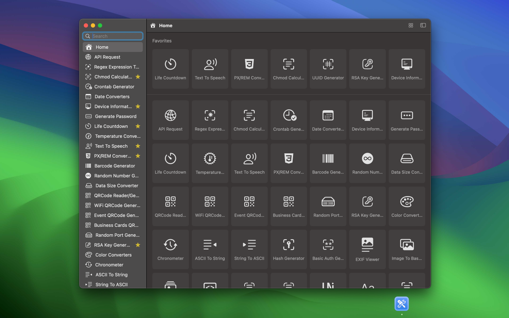
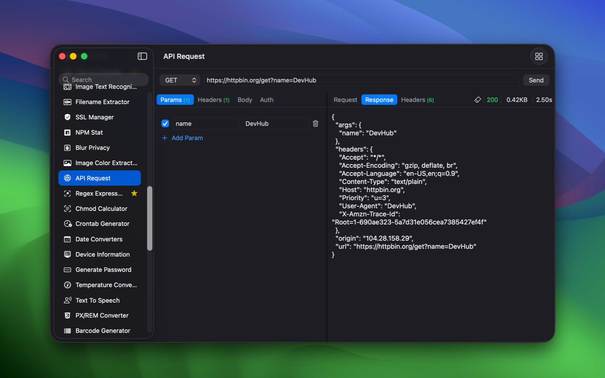
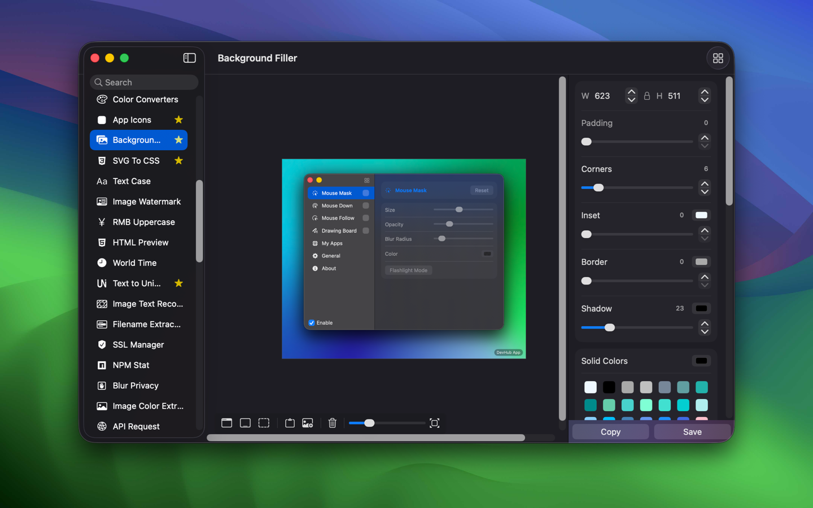
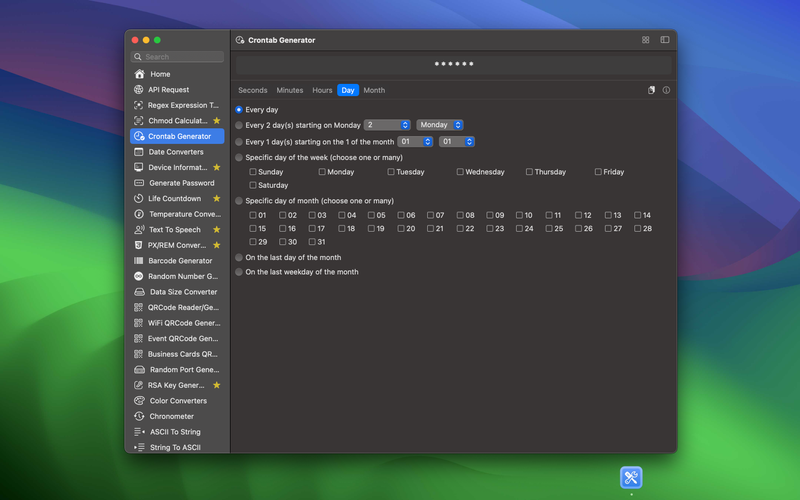
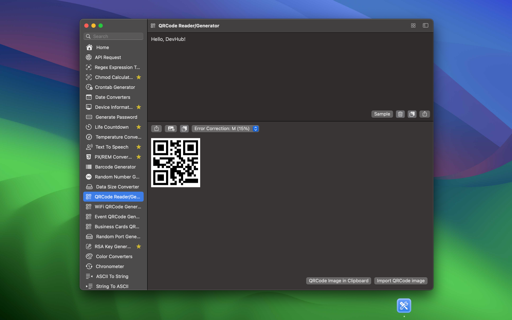
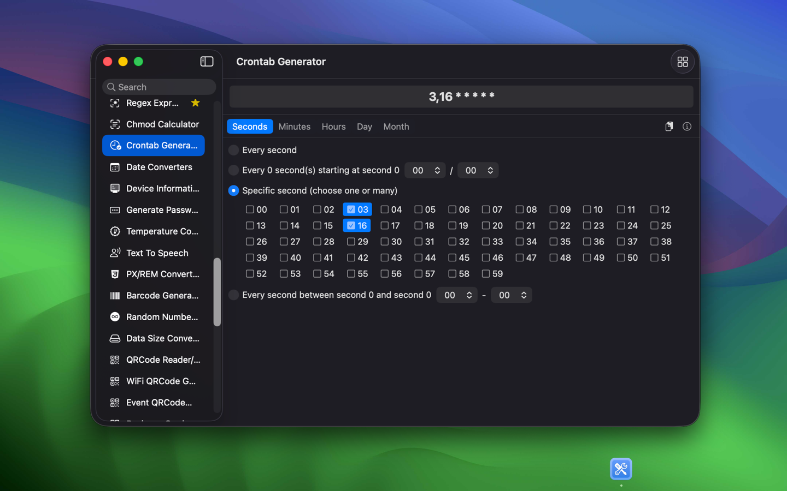
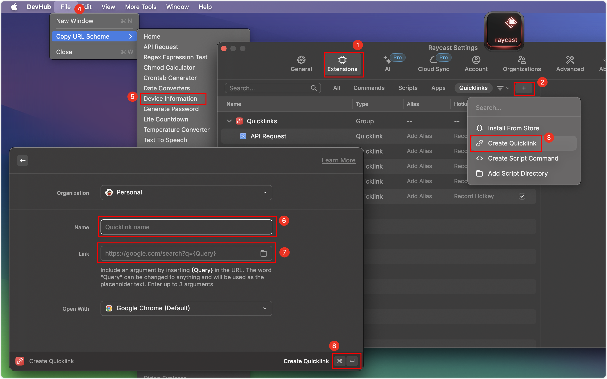

<div align="center">
	<br />
	<br />
	
	<h1>DevHub</h1>
  <!--rehype:style=border: 0;-->
  <p>
		<a href="./README.md">English</a> • 
		<a href="./README.zh.md">中文</a> • 
		<a href="#よくある質問">FAQ</a> • 
		<a target="_blank" href="https://wangchujiang.com/#/contact">Contact & Support</a>
  </p>
  <p>
    <a target="_blank" href="https://apps.apple.com/app/devhub/id6476452351" title="DevHub AppStore">
    </a>
    <a target="_blank" href="https://www.producthunt.com/posts/devhub-6?utm_source=badge-featured&amp;utm_medium=badge&amp;souce=badge-devhub-6">
    </a>
  </p>
</div>

<div align="center">

最低OS要件: `macOS 14.0`

</div>

開発者の日常業務をサポートし、データの最高のセキュリティを確保するために慎重に作成された機能豊富なオフラインアプリケーションです。

私は積極的に開発を進めており、毎週更新をリリースするという大胆な目標を掲げています。私はスリムなフットプリントを維持し、100以上のユーティリティを含む広範なコレクションをキュレーションすることを目指しています。これにより、開発者に多様なツールを提供します。この取り組みは、継続的な改善へのコミットメントを反映しており、開発者に豊富なツールを提供します。DevHubは単なるコーディングの仲間ではありません。



以下のツールが完成しています：

- [x] CodeMirror テキストエディタ
- [x] Prettier コードフォーマット
- [x] HTML フォーマットと圧縮ツール
- [x] MIME タイプ
- [x] Base64/ファイルコンバーター
- [x] SVG を CSS に変換
- [x] JWT パーサー
- [x] 人民元大字（人民幣の大字表記）
- [x] 世界時計
- [x] ファイル情報
- [x] 画像テキスト認識
- [x] ファイル名抽出ツール
- [x] SSLマネージャー
- [x] 画像透かし
- [x] NPM統計
- [x] プライバシーぼかし
- [x] テキストカード
- [x] アプリアイコン
- [x] 画像カラー抽出
- [x] カーソルハイライト
- [x] 背景フィラー
- [x] APIリクエスト
- [x] 正規表現テスト
- [x] Chmod計算機
- [x] Crontabジェネレーター
- [x] 日付変換ツール
- [x] デバイス情報
- [x] パスワード生成
- [x] ライフカウントダウン
- [x] 温度変換ツール
- [x] テキスト読み上げ
- [x] PX/REM変換ツール
- [x] バーコード生成
- [x] ランダム数生成
- [x] データサイズ変換ツール
- [x] QRコードリーダー/生成
- [x] WiFi QRコード生成
- [x] イベントQRコード生成
- [x] 名刺QRコード生成
- [x] ランダムポート生成
- [x] RSAキー生成
- [x] カラー変換ツール
- [x] ランダムカラー
- [x] クロノメーター
- [x] ASCIIから文字列
- [x] 文字列からASCII
- [x] ハッシュ生成
- [x] ベーシック認証生成
- [x] EXIFビューア
- [x] 画像からBase64
- [x] ICO変換ツール
- [x] HTMLエンコード/デコード
- [x] HTMLプレビュー
- [x] 文字列エクスプローラー
- [x] テキストからBase64
- [x] テキストからUnicode
- [x] テキストケース
- [x] テキスト差分
- [x] ワードカウンター
- [x] モールスアルファベット
- [x] JSONフォーマッター
- [x] ランダムテキスト生成
- [x] UUID生成
- [x] URLパーサー
- [x] URLエンコード/デコード








## よくある質問

### DevHubの統合

DevHubとの統合はURLスキームを介して行われます。これを使用して、ほとんどのアプリやワークフローと統合できます。例えば、Raycastとの統合：



**URLスキーム**

DevHubは、URLを介してツールをアクティブにするためのさまざまなコマンドとパラメーターをサポートしています。例えば、次のようにリンク（HTMLページなど）で使用できます：

```html
<a href="devhub://qrCodeEventGenerator">ここをクリック</a>
```

または**Terminal.app / CLI**から：

```bash
# Terminal.appまたはbashで入力：
open "devhub://qrCodeEventGenerator"
```

または、これをブラウザのアドレスバーにコピーしてEnterキーを押します： `devhub://qrCodeEventGenerator`

<!--idoc:config:
title: 開発者統合ツール - 
-->
