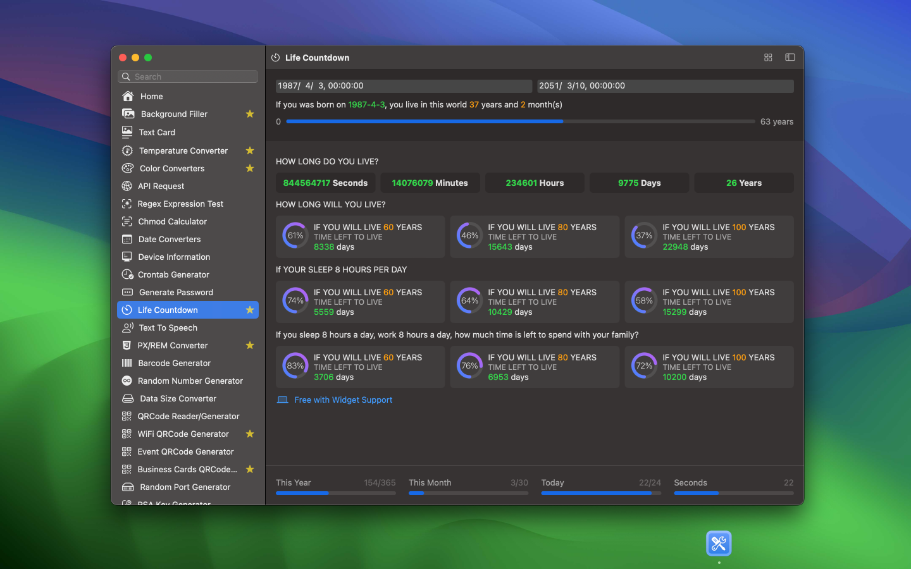

<div align="center">
	<br />
	<br />
	
	<h1>DevHub</h1>
  <!--rehype:style=border: 0;-->
  <p>
		<a href="./README.zh.md">中文</a> • 
		<a href="./README.ja.md">日本語</a> • 
		<a href="#frequently-asked-questions">FAQ</a> • 
		<a href="./CHANGELOG.md">변경사항</a> • 
		<a target="_blank" href="https://wangchujiang.com/#/contact">문의와 지원</a>
  </p>
  <p>
    <a target="_blank" href="https://apps.apple.com/app/devhub/id6476452351" title="DevHub AppStore">
    </a>
  </p>
</div>

<div align="center">

최소 OS 요구사항: `macOS 14.0`

</div>

개발자들의 일상적인 작업을 지원하고 데이터의 최고 보안을 보장하기 위해 세심하게 제작된 기능이 풍부한 오프라인 애플리케이션이에요.

저는 매주 업데이트를 출시하겠다는 대담한 목표를 가지고 활발하게 개발하고 있어요. 100개 이상의 유틸리티로 구성된 광범위한 컬렉션을 구성하여 개발자들에게 다양한 도구를 제공하면서 가벼운 설치 용량을 유지하려고 노력하고 있어요. 이 계획이 지속적인 개선에 대한 저의 의지를 반영하며, 개발자들에게 힘을 실어주는 풍부한 도구를 제공해요. DevHub는 단순한 코딩 도우미 그 이상이랍니다.


다음과같은 도구들을 제공해요:

- [x] HTML to Markdown
- [x] 텍스트를 NATO 알파벳으로 변환
- [x] CodeMirror 텍스트 에디터
- [x] Prettier 코드 포맷팅
- [x] HTML 포맷팅 및 압축 도구
- [x] MIME 타입
- [x] Base64/파일 변환기
- [x] SVG To CSS
- [x] JWT 파서
- [x] 인민폐 대문자 변환
- [x] 세계 시간
- [x] 파일 정보
- [x] 이미지 텍스트 인식
- [x] 파일명 추출기
- [x] SSL 관리자
- [x] 이미지 워터마크
- [x] NPM 통계
- [x] 블러 프라이버시
- [x] 텍스트 카드
- [x] 앱 아이콘
- [x] 이미지 색상 추출
- [x] 하이라이트 커서
- [x] 배경 채우기
- [x] API 요청
- [x] 정규식 테스트
- [x] Chmod 계산기
- [x] Crontab 생성기
- [x] 날짜 변환기
- [x] 기기 정보
- [x] 비밀번호 생성기
- [x] 생명 카운트다운
- [x] 온도 변환기
- [x] 텍스트 음성 변환
- [x] PX/REM 변환기
- [x] 바코드 생성기
- [x] 난수 생성기
- [x] 데이터 크기 변환기
- [x] QR코드 읽기/생성기
- [x] WiFi QR코드 생성기
- [x] 이벤트 QR코드 생성기
- [x] 명함 QR코드 생성기
- [x] 랜덤 포트 생성기
- [x] RSA 키 생성기
- [x] 색상 변환기
- [x] 랜덤 색상
- [x] 스톱워치
- [x] ASCII를 문자열로 변환
- [x] 문자열을 ASCII로 변환
- [x] 해시 생성기
- [x] Basic Auth 생성기
- [x] EXIF 뷰어
- [x] 이미지를 Base64로 변환
- [x] ICO 변환기
- [x] HTML 인코딩/디코딩
- [x] HTML 미리보기
- [x] 문자열 탐색기
- [x] 텍스트를 Base64로 변환
- [x] 텍스트를 유니코드로 변환
- [x] 텍스트 케이스
- [x] 텍스트 비교
- [x] 단어 카운터
- [x] 모스 알파벳
- [x] JSON 포맷터
- [x] Lorem Ipsum 생성기
- [x] UUID 생성기
- [x] URL 파서
- [x] URL 인코딩/디코딩





## 자주 묻는 질문

### DevHub 통합

DevHub와의 통합은 URL Scheme을 통해 수행돼요. 이를 사용하여 대부분의 앱과 워크플로우와 통합할 수 있어요. 예를 들어 Raycast와 통합할 수 있어요:


**URL Scheme**

DevHub는 URL을 통해 도구를 활성화할 수 있는 다양한 명령과 매개변수를 지원해요. 예를 들어, 다음과 같이 링크(예: HTML 페이지)로도 사용할 수 있어요.:

```html
<a href="devhub://qrCodeEventGenerator">여기를 클릭하세요!</a>
```

아니면 **Terminal.app / CLI**에서:

```bash
# Terminal.app 또는 bash에서 입력:
open "devhub://qrCodeEventGenerator"
```

아니면 브라우저 주소창에 다음을 복사하고 엔터를 눌러주세요: `devhub://qrCodeEventGenerator`

<!--idoc:config:
title: Developer Integration Tools - 
-->