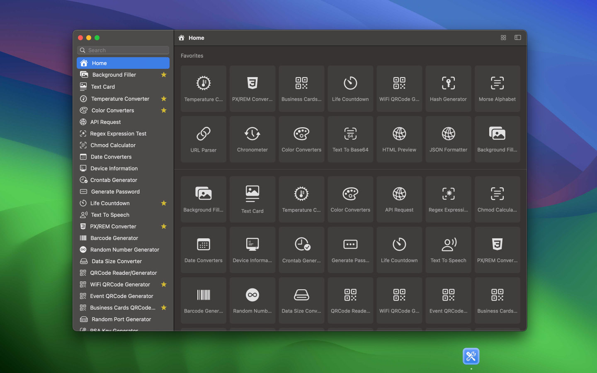

	 
	 
	
  

		<a href="./README.zh.md">中文</a> • 
		<a href="./privacy-policy.md">Privacy Policy</a> • 
		<a target="_blank" href="https://wangchujiang.com/#/contact">Contact & Support</a>
  

	<h1>DevHub</h1>
  <!--rehype:style=border: 0;-->
  

    
    
  

A feature-rich offline application, carefully crafted to support developers' daily tasks and ensure the highest security for their data.

I am actively developing it with a bold goal in mind: to release updates weekly. I strive to maintain a lean footprint, aiming to curate an extensive collection comprising over 100 utilities, providing developers with a diverse array of tools. This initiative reflects my commitment to continuous improvement, offering rich tools to empower developers. DevHub is more than just a coding companion;

The following tools have been completed:

- [x] API Request
- [x] Regex Expression Test
- [x] Chmod Calculator
- [x] Crontab Generator
- [x] Date Converters
- [x] Device Information
- [x] Generate Password
- [x] Life Countdown
- [x] Temperature Converter
- [x] Text To Speech
- [x] PX/REM Converter
- [x] Barcode Generator
- [x] Random Number Generator
- [x] Data Size Converter
- [x] QRCode Reader/Generator
- [x] WiFi QRCode Generator
- [x] Event QRCode Generator
- [x] Business Cards QRCode Generator
- [x] Random Port Generator
- [x] RSA Key Generator
- [x] Color Converters
- [x] Chronometer
- [x] ASCII To String
- [x] String To ASCII
- [x] Hash Generator
- [x] Basic Auth Generator
- [x] EXIF Viewer
- [x] Image To Base64
- [x] ICO Converter
- [x] HTML Encode/Decode
- [x] String Explorer
- [x] Text To Base64
- [x] Text to Unicode
- [x] Text Case
- [x] Morse Alphabet
- [x] Lorem Ipsum Generator
- [x] UUID Generator
- [x] URL Parser
- [x] URL Encode/Decode

