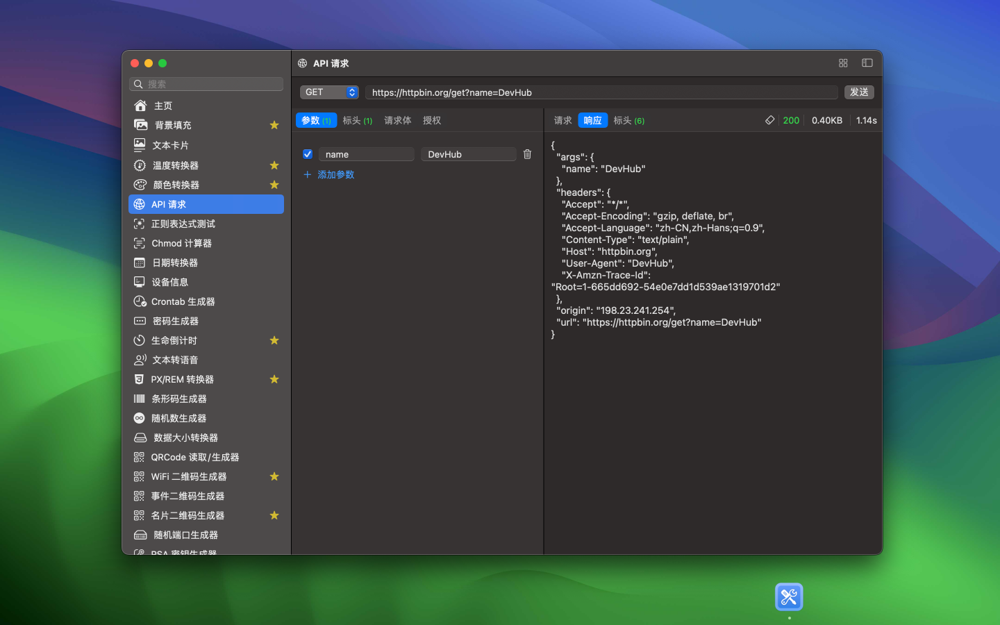
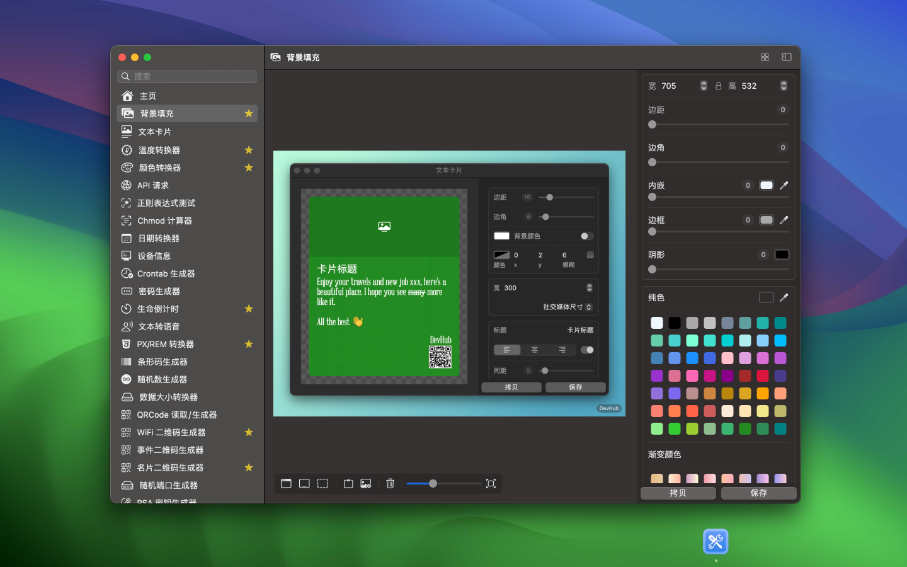
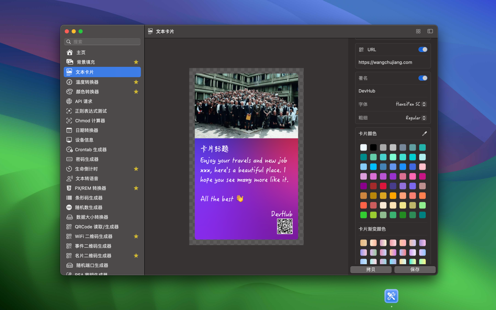

	 
	 
	
  

		<a href="./README.md">English</a> • 
    <a target="_blank" href="https://apps.apple.com/app/devhub/id6476452351">AppStore</a> • 
		<a target="_blank" href="https://wangchujiang.com/#/contact">联系&支持</a>
  

	<h1>DevHub</h1>
  <!--rehype:style=border: 0;-->
  

    
    
  

一个功能丰富的离线应用程序，精心打造，旨在支持开发人员的日常任务，并确保其数据的最高安全性。

目前正在积极开发中，DevHub 树立了一个大胆的目标：每周发布更新。努力保持紧凑的足迹，目标是策划一个包含100多个小工具的广泛集合，为开发人员提供多样化的工具。

这一举措体现了我们对持续提升的承诺，提供丰富的工具，以赋能开发人员。DevHub 不仅是一个编码伴侣；它是一个每周演进以满足开发人员不断变化需求的动态平台。凭借先进的调试、测试和不断增长的工具集，DevHub 站在我们优化编码工作流程、确保高效编码体验的承诺的见证。加入我们的行列，随着我们持续完善和扩展 DevHub，使其成为全球开发者不可或缺的资源。

以下工具已完成：

- [x] API 请求
- [x] 正则表达式测试
- [x] Chmod 计算器
- [x] 日期转换器
- [x] 设备信息
- [x] 密码生成器
- [x] 生命倒计时
- [x] 温度转换器
- [x] 文本转语音
- [x] PX/REM 转换器
- [x] 条形码生成器
- [x] 随机数生成器
- [x] 数据大小转换器
- [x] QRCode 读取/生成器
- [x] WiFi 二维码生成器
- [x] 事件二维码生成器
- [x] 名片二维码生成器
- [x] 随机端口生成器
- [x] RSA 密钥生成器
- [x] 颜色转换器
- [x] 精密计时器
- [x] ASCII 转字符串
- [x] 字符串转 ASCII
- [x] 哈希生成器
- [x] 基本验证生成器
- [x] EXIF 查看器
- [x] 图片转 Base64
- [x] ICO 转换器
- [x] HTML 编码/解码
- [x] 字符串浏览器
- [x] 文本转 Base64
- [x] 文本转Unicode
- [x] 文本案例
- [x] 摩尔斯电码
- [x] 乱数假文生成器
- [x] UUID 生成器
- [x] URL解析器
- [x] URL 编码/解码

