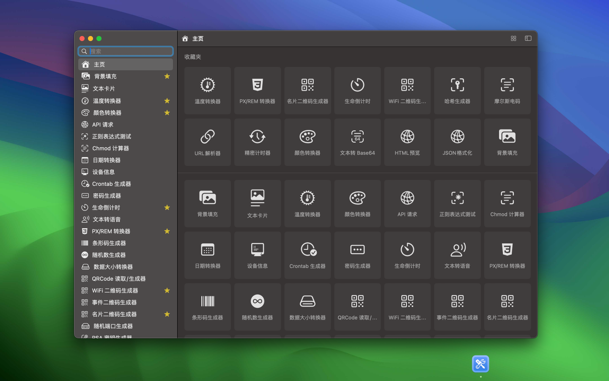
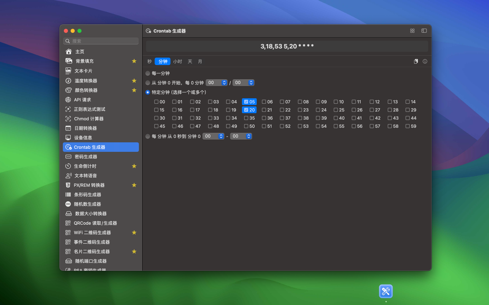
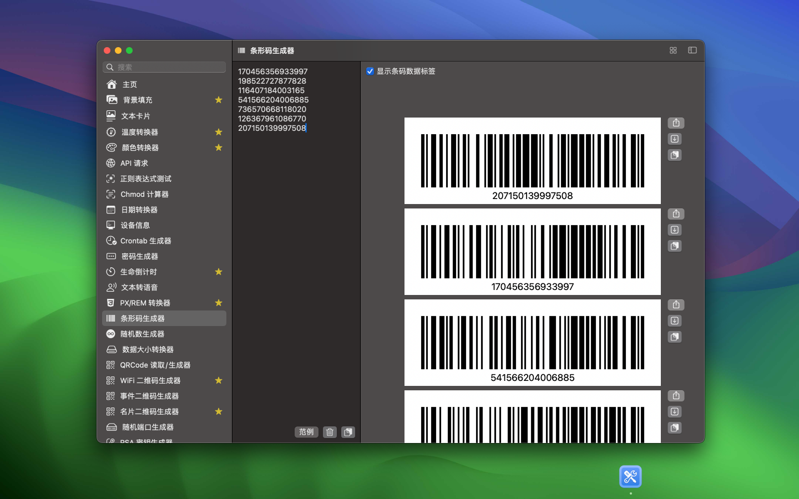
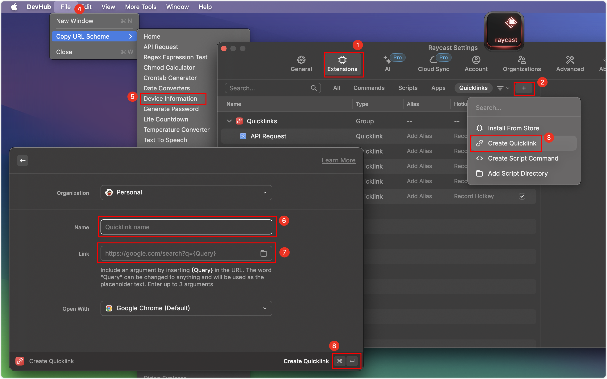

<div align="center">
	<br />
	<br />
	
	<h1>DevHub</h1>
  <!--rehype:style=border: 0;-->
  <p>
		<a href="./README.md">English</a> • 
		<a href="./README.ja.md">日本語</a> • 
		<a href="#常见问题解答">常见问题</a> • 
    	<a href="./CHANGELOG.zh.md">更新日志</a> • 
		<a target="_blank" href="https://wangchujiang.com/#/contact">联系&支持</a>
  </p>
  <p>
    <a target="_blank" href="https://apps.apple.com/app/devhub/id6476452351" title="DevHub AppStore">
    </a>
  </p>
</div>

<div align="center">

最低操作系统要求：`macOS 14.0`

</div>

一个功能丰富的离线应用程序，经过精心打造，旨在支持开发人员的日常任务，并确保其数据的最高安全性。

我正在积极开发中，并树立了一个大胆的目标：每周发布更新。我努力保持紧凑的足迹，旨在策划一个包含100多个小工具的广泛集合，为开发人员提供多样化的工具。这一举措体现了我对持续提升的承诺，提供丰富的工具，以赋能开发人员。DevHub不仅仅是一个编码伴侣；



已完成的工具如下：

- [x] 人民币大写
- [x] 世界时间
- [x] 文件信息
- [x] 图片文本识别
- [x] 文件名提取助手
- [x] SSL 管理
- [x] 图片水印
- [x] NPM 统计
- [x] 模糊隐私
- [x] 文本卡片
- [x] 应用图标
- [x] 图片颜色提取
- [x] 突显光标
- [x] 背景填充
- [x] API 请求
- [x] 正则表达式测试
- [x] Chmod 计算器
- [x] Crontab 生成器
- [x] 日期转换器
- [x] 设备信息
- [x] 密码生成器
- [x] 生命倒计时
- [x] 温度转换器
- [x] 文本转语音
- [x] PX/REM 转换器
- [x] 条形码生成器
- [x] 随机数生成器
- [x] 数据大小转换器
- [x] QRCode 读取/生成器
- [x] WiFi 二维码生成器
- [x] 事件二维码生成器
- [x] 名片二维码生成器
- [x] 随机端口生成器
- [x] RSA 密钥生成器
- [x] 颜色转换器
- [x] 随机颜色
- [x] 精密计时器
- [x] ASCII 转字符串
- [x] 字符串转 ASCII
- [x] 哈希生成器
- [x] 基本验证生成器
- [x] EXIF 查看器
- [x] 图片转 Base64
- [x] ICO 转换器
- [x] HTML 编码/解码
- [x] HTML 预览
- [x] 字符串浏览器
- [x] 文本转 Base64
- [x] 文本转Unicode
- [x] 文本案例
- [x] 文本比对
- [x] 字数统计器
- [x] 摩尔斯电码
- [x] JSON 格式化器
- [x] 乱数假文生成器
- [x] UUID 生成器
- [x] URL解析器
- [x] URL 编码/解码






## 常见问题解答

### DevHub 集成

与 DevHub 的集成是通过 URL Scheme 完成的。您可以使用此功能与大多数应用程序和工作流集成。例如与 Raycast 集成：



**URL Scheme**

**DevHub** 支持各种命令和参数，允许您通过 URL 激活该工具。例如，您也可以像这样在链接中使用它（例如在 HTML 页面中）：

```html
<a href="devhub://qrCodeEventGenerator">点击这里</a>
```

或者从 **Terminal.app / CLI** 中：

```bash
# 在 Terminal.app 或 bash 中输入：
open "devhub://qrCodeEventGenerator"
```

或者将此复制到您的浏览器地址栏中，然后按 Enter 键： `devhub://qrCodeEventGenerator`

